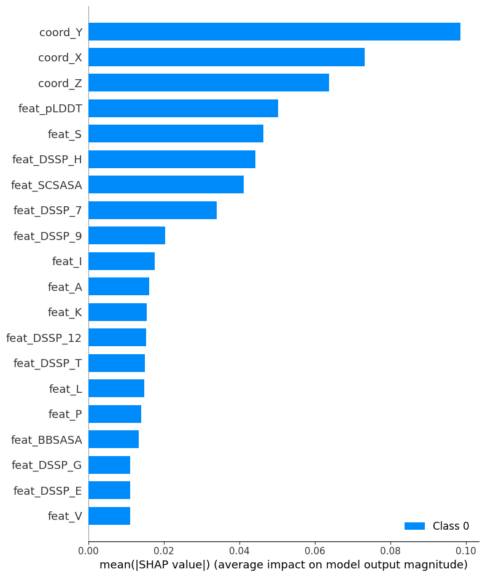
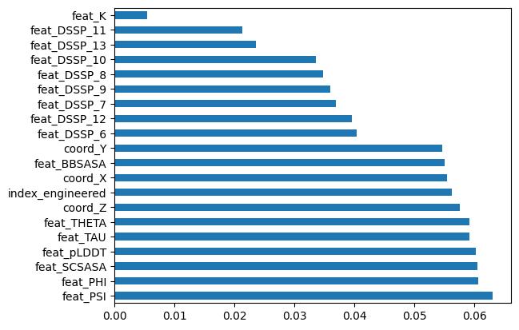

# Outline of Project 
Built a neural network, which reached a ROC AUC score of ~0.84 on the validation set.

## Model Details
The model is made up of 7 layers
1. Input layer
2. Dense layer with 64 nodes and relu activation
3. Dropout layer with 0.2 dropout rate
4. Reshape layer to reshape the data to a 1D tensor
5. Global Average Pooling layer
6. Dense layer with 32 nodes and relu activation
7. Output layer

We found that shrinking our model to 7 layers improved performance. 

## Index_Engineered Feature
We augmented the entry_index column, to create a new feature, which is the relative index of the residue in the protein. For example, if a protein has 20 residues, then the first residue will have an index_engineered of 0.05. We believed that this would be a relevant feature as residues in the middle of a protein may be more likely to bind to a drug molecule than residues at the end of a protein.

# Technologies Used
- We use Python with Tensorflow, Pandas, Sklearn, imblearn.SMOTE and SHAP packages
- TensorFlow: To create and train the neural network
- Sklearn: To scale and split data as well as to evaluate the model metrics
- SMOTE: Oversample the miniority class, which is the residue belongs to a known binding site, and in total there is ~770k records in the oversampled training dataset
- SHAP: To calculate and visualize feature importance

# Challenges Faced
## Lack of Domain Knlowledge

We were not familiar with the domain of the data, so we spent a large amount of time trying to engineer features, without understanding what they are doing. This problem also came up when we were looking for external data, as the we were never sure if we were getting the correct values for the features we were looking for.

## Model Selection
We spent a considerable amount of time trying different models. With one method of oversampling the minority class and the second of making the class cost-sensitive.

- Logistic Regression
- GBM
- Bagging
- XGBoost
- Random Forest

Out of the above models, XGBoost was the most promising, however, the Neural Network outperformed it. Additionally, the Neural Network offered more flexibility even though it is not as explainable as alternatives. 

## Parameters tuning NN
- We first tried all NN with all layers be Fully connected linear layers and the model seems to be overfitted.
- We then resorted to adding one Dropout layer with parameter $0.2$, a mask that nullifies the contribution of some neurons towards the next layer and leaves unmodified all others. 
 
# Outcomes
- We were able to obtain a fairly high ROC AUC score of 0.84.
- Relatively small model, which trains quckly on CPU in under 10 minutes.

# Feature Importance

## Feature Importance using SHAP

From this visualization, we can see that the x, y and z coordinates are given considerable importance in our model. We understand that the layout and shape of a protein is critical to its function. In our case, the x, y and z coordinates may be involved in determining the shape and size of binding pockets which bind to drug molecules. The coordinates may also be used to determine various molecular properties such as hydrogen bonding and van der Waals forces, which can be predictors for how well a drug can bind to a protein. 

## Feature Importance using Random Forest

Using Random Forest highlighted several different features as important, however, we still see the x, y and z coordinates show up. This leads us to conclude that those 3 coordinates are the most important for our model. This makes sense given their role in protein structure. 

